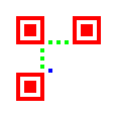
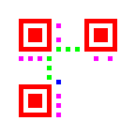
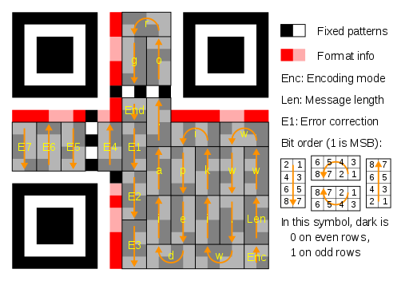
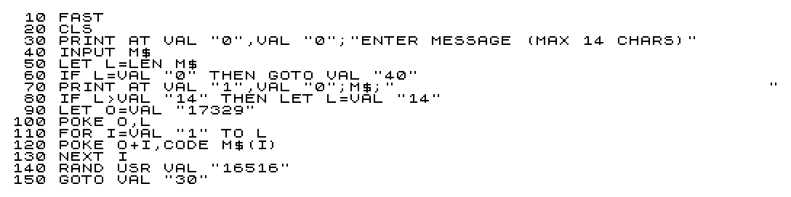

My first job was as a support analyst at Xerox Brazil for their high-speed printers, the kind that you plug directly into a [Bus and Tag](https://en.wikipedia.org/wiki/Bus_and_Tag) interface to connect them to IBM mainframes. Their use varied from reports and code listings to bank checks and invoices printing.

In Brazil there's a standardized document that can be used to pay for goods and services called [boleto](https://en.wikipedia.org/wiki/Boleto), which is accepted in all banks and ATMs. It uses a barcode called [Interleaved 2 of 5](https://en.wikipedia.org/wiki/Interleaved_2_of_5), supported by Xerox printers using a special font.

Because boletos were one of biggest motives banks bought printers, my boss made me learn how to decode 2 of 5 barcodes by hand, just by taking note of the width of each bar. I like to think this was important for my profession, but looking back I think it was just a prank.

However, I really liked barcodes, and started to learn about other standards like [Code 39](https://en.wikipedia.org/wiki/Code_39) and [EAN-13](https://en.wikipedia.org/wiki/International_Article_Number), the later being easily to recognize as they're printed on the box of every product you can find on the shelves in supermarkets.

Today, I'm mostly interested in 2D barcodes such as [Data Matrix](https://en.wikipedia.org/wiki/Data_Matrix) (mainly because it's in the public domain and have a [free, open source library](https://github.com/dmtx) that can read and write such barcodes), and [QR Codes](https://en.wikipedia.org/wiki/QR_code) (because everyone recognizes them and know that they can be scanned, have widespread use, and in my opinion are easy on the eyes).

I keep daydreaming about using barcodes in old computers to achieve augmented technology, where some other, modern hardware can work together with the old one to help it achieve something it cannot on its own. Since the first computer I bought was a ZX81, with the intent of writing games, it's only natural that I make it able to generate a barcode that can be read by commodity devices such as cellphones.

## QR Codes

One-dimension barcodes are usually easy to generate, as they don't mandate any kind of marks and/or error correction code to be present in the data. Applications using these barcodes would usually employ some simple [checksum](https://en.wikipedia.org/wiki/Checksum) to prevent erroneous data from entering the system, but it was all ad-hoc. Unfortunately, 1D barcodes are not really suitable for a ZX81, since the unmodified hardware had a graphics resolution of 64x48 pixels, too small to generate barcodes with any meaningful data.

Two-dimensions barcodes on the other hand usually have complex ways to encode the message, and mandate some kind of error correction to be present so that the code can be read even if it's damaged. [The maths behind the error correction calculation](https://www.thonky.com/qr-code-tutorial/error-correction-coding) are way over my head, but one day I was reading the [Paged Out!](https://pagedout.institute/) magazine issue 2 and stumbled into an article titled *An artisanal QR code* where the author shows how to create a QR Code from scratch without any dependencies.

The code is small because it can only generate QR Code version 1, and is hardcoded to ECC (Error Correction Code) level M, and mask 0 (checkerboard). While this may sound too limiting, these allow for up to 14 bytes of data with very little code. Support for all types, ECC levels, and masks would render this project impractical for the humble ZX81, as it's easy to see [here](https://www.thonky.com/qr-code-tutorial/data-masking).

With that, I knew I could finally write some Z80 assembly to generate QR Codes.

## Preparation

The first thing we'll do is understand the JavaScript code in the Paged Out! article. It does a good job, except when we start drawing the QR Code. Thankfully, there are other sources of information that we can use to fill in the blanks.

### Message Encoding

The first translated piece is the function that encodes the message into the right format for the QR Code.

```js
function to_binary(n) {
    return n.toString(2).padStart(8, "0");
}

function prepare(s, len) {
    // convert s to binary
    var data = s.split('').map(x => to_binary(x.charCodeAt(0)));

    // prepend header
    data.unshift(to_binary(s.length));
    data.unshift("0100");

    // append footer
    data.push("0000")

    var pad = 0xec;

    while ((data.length - 1) < len) {
        data.push(to_binary(pad));
        pad = pad ^ 0xfd;
    }

    // join and split into bytes
    return data.join('').match(/.{8}/g).map(x => parseInt(x, 2));
}

var str = "PagedOut!";
var data = prepare(str, 16);
```

`prepare` begins by creating an array of strings, where each position has a string with the binary representation of the corresponding character in the original message. This array is like a [bitstream](https://en.wikipedia.org/wiki/Bitstream), where bits can be added at will.

After that, it performs some steps to format the message:

1. Prepend 8 bits with the length of the message
1. Prepend `"0100"`, which means that the message uses binary encoding
1. Append `"0000"`, which is the end of message mark
1. Append alternated binary representations of `0xec` and `0x11`, until the message has `len*8` bits (`len` here is 16, the maximum for this QR Code type)

Example:

|Value|Description|
|-|-|-|
|`0b0100`|Use binary encoding|
|Length (8 bits)|Message length, up to 14 bytes|
|`'P'`|Message|
|`'a'`||
|`'g'`||
|`'e'`||
|`'d'`||
|`'O'`||
|`'u'`||
|`'t'`||
|`'!'`||
|`0b0000`|End of message mark|
|0xec|Padding|
|0x11||
|0xec||
|0x11||
|0xec||

With the bits in place, the code converts the array into an array of bytes and returns it. In this example, this array is:

```js
[ 64, 149, 6, 22, 118, 86, 68, 247, 87, 66, 16, 236, 17, 236, 17, 236 ]
```

### The ECC Polynomial

The ECC used in QR Codes is the [Reed-Solomon](https://en.wikipedia.org/wiki/Reed%E2%80%93Solomon_error_correction). The theory and math behind it is way over my head, but we don't need to understand it because. Thankfully, all we need is to use the functions provided in the article.

```js
// Galois Field multiplication (using Russian
// Peasant Multiplication method)
function gf_mul(x, y, mod) {
    var r = 0;

    while (y>0) {
        if (y & 1) { r ^= x; }

        y >>= 1; x <<= 1;

        if (x > 255) { x ^= mod; }
    }

    return r;
}

function gf_pow(x, n, mod) {
    var r = 1;

    for (var i=0; i<n; i++) {
        r = gf_mul(r, x, mod);
    }

    return r;
}

function polynomial_mul(p, q, mod) {
    var r = [];
    for (var i=0; i<p.length; i++) {
        for (var j=0; j<q.length; j++) {
            r[i + j] ^= gf_mul(p[i], q[j], mod);
        }
    }
    return r;
}

function get_generator_poly(n) {
    var g = [1];

    for (var i=0; i<n; i++) {
        g = polynomial_mul(g, [1, gf_pow(2, i, 285)], 285);
    }

    return g;
}

var generator_poly = get_generator_poly(10);
```

With those function implemented, we can generate the polynomial used in the ECC level M, but instead of using all that code to create `generator_poly`, we'll hardcode the resulting 11-bytes polynomial in our code since it'll save us precious bytes in the ZX81:

```js
[ 1, 216, 194, 159, 111, 199, 94, 95, 113, 157, 193 ]
```

### The ECC

With the generator polynomial at hand, the following code will compute the ECC for the given message.

```js
function polynomial_mod(a, b, mod) {
    var n = a.length - b.length + 1;
    
    while (b.length < a.length) {
        b.push(0);
    }
    
    for (var i=0; i<n; i++) {
        var f = a[0];
        
        for (var j=0; j<b.length; j++) {
            a[j] = a[j] ^ gf_mul(b[j], f, mod);
        }
        
        a.shift();
        b.pop();
    }
    
    return a;
}

var ecc = polynomial_mod(
    data.concat(new Array(10)),
    generator_poly,
    285
);
```

It's easier to understand what it does if we take a look at the equivalent C code.

```c
// Polynomial modulus.
static void qrc1_polymod(uint8_t* const a,
                         size_t const lena,
                         uint8_t const* const b,
                         size_t const lenb,
                         uint16_t const mod) {

    // Zero the part of A that will contain the modulus.
    memset(a + lena, 0, lenb - 1);
    size_t const maxlena = lena + lenb - 1;

    // Perform the modulus.
    for (size_t i = 0; i < lena; i++) {
        uint8_t const f = a[i];

        for (size_t j = 0; j < (maxlena - i); j++) {
            a[i + j] ^= qrc1_gfmul(j < lenb ? b[j] : 0, f, mod);
        }
    }
}

// The encoded message always has 16 bytes, and the generator
// always has 11 bytes. msg must have 26 bytes to
qrc1_polymod(msg, 16, generator, 11, 285);
```

The result is computed at the end of `a`, so we zero the bytes at `a + lena`. Because of that, `a` must have 26 bytes, which is the exact amount of data and ECC that we'll add the to QR Code.

The `for` loops will then iterate over the polynomials and do their magic. It's important to notice that `qrc1_polymod` destroys the original message, so we have to have a copy somewhere.

### The Format Information

I said that this QR Code is hardcoded to ECC level M, and mask 0. This information must be present somewhere in the QR Code so that barcode readers know how to decode it. The format info is a sequence of 5 bits that contain this information:

1. Two bits for the ECC level (`0b00`)
1. Three bits for the mask index (`0b000`)

The format info has some error correction code of its own, and the resulting sequence is xor'ed with a predefined sequence of bits to give the final 15-bits sequence that goes into the QR Code.

```js
var format = [0, 0, 0, 0, 0];
var format_info = format.concat(
    polynomial_mod(
        format.concat(new Array(10)),
        [1,0,1,0,0,1,1,0,1,1,1],
        1335
    )
);

var mask = [1,0,1,0,1,0,0,0,0,0,1,0,0,1,0];

for (var i=0; i<format_info.length; i++) {
    format_info[i] ^= mask[i];
}
```

Since the format info is always the same, we'll use the hardcoded value to save some bytes.

```js
[ 1, 0, 1, 0, 1, 0, 0, 0, 0, 0, 1, 0, 0, 1, 0 ]
```

### Drawing

The QR Code version 1 has 21x21 modules (pixels), some of which are fixed and must be present regardless of the encoded message and format info.

Starting with a blank canvas, the three finders patterns (in red below) must be drawn, along with the timing patterns (in green), and the "dark" module (in blue).




On top of this "blank" QR Code we draw the format info and the encoded message. However, since our format info is hardcoded, we can draw it as part of the fixed modules (in magenta).




Now the only thing missing is the encoded message. To draw it, we must follow a zigzag pattern starting at the bottom-right module and going up to the format info, then go to the left and continuing down up to the border, then up again until we draw all the bits from the encoded message, like in the image below.




It's possible to notice the four bits for the encoding type (Enc), the eight bits with the length of the message (Len), then the message contents (`www.wikipedia.org` in the image), end end of message mark (End), and the ECC bytes (E1 to E7). In our case, we have 10 bytes of ECC, but the zigzag pattern is exactly the same.

Every time we draw a module, a mask must be applied. The purpose of the mask is to increase the odds that the QR Code will be successfully decoded by trying to avoid patterns in the code that look like the finders patterns, and having the same amount of black and white modules.

The process of finding the best mask is not complicated but would greatly increase the size of the program, so we hardcode the checkerboard mask.

Since drawing depends on the device, we'll see how the QR Code is drawn onto the ZX81 screen later.

## Translating to Z80 Asm

Before translating the code to assembly, we have to think about how we want the program to work. Instead of having a ZX81 program that always shows the same QR Code, we'll write a program that asks the user for the message, then encodes it and draws the QR Code onto the screen, and then goes back to the first step.

Instead of using machine code for everything, we'll use BASIC for everything except the encoding and drawing. The program is this:




Some magic numbers present in the program come from the machine code side: 17329 is where we put the message length, and the message characters following it, and 16516 is where the machine code routine that encodes and draws the QR Code starts.

With that part behind us, lets take care of the assembly.

### ASCII Translation

Before encoding the message, we must translate the characters from the [proprietary encoding used in the ZX81](https://en.wikipedia.org/wiki/ZX81_character_set#Character_set) to ASCII. This is done via a simple loop that takes a ZX81 character, uses it's value to index a table, and gets the ASCII character from the table.

```
to_ascii:
    ; Make HL point to the unencoded message.
    ld hl, qrc1_message

    ; B has the message length.
    ld b, (hl)
    inc hl

xlate_loop:
        ; Put the ZX81 character in A, making sure it's valid and non-inverted.
        ld a, (hl)
        and $3f

        ; Get the corresponding ASCII character in the translation table.
        add a, xlate_table & $ff
        ld e, a
        ld a, 0
        adc a, xlate_table >> 8
        ld d, a
        ld a, (de)

        ; Overwrite with the ASCII char.
        ld (hl), a
        inc hl
    djnz xlate_loop
    ret

xlate_table:
    ; spc gra gra gra gra gra gra gra gra gra gra  "   £   $   :   ?
    db ' ', '?', '?', '?', '?', '?', '?', '?', '?', '?', '?', '"', '?', '$', ':', '?'

    ;  (   )   >   <   =   +   -   *   /   ;   ,   .   0   1   2   3
    db '(', ')', '>', '<', '=', '+', '-', '*', '/', ';', ',', '.', '0', '1', '2', '3'

    ;  4   5   6   7   8   9   A   B   C   D   E   F   G   H   I   J
    db '4', '5', '6', '7', '8', '9', 'A', 'B', 'C', 'D', 'E', 'F', 'G', 'H', 'I', 'J'

    ;  K   L   M   N   O   P   Q   R   S   T   U   V   W   X   Y   Z
    db 'K', 'L', 'M', 'N', 'O', 'P', 'Q', 'R', 'S', 'T', 'U', 'V', 'W', 'X', 'Y', 'Z'
```

Some characters that don't exist in the US-ASCII character set are translated to `'?'`.

### Message Encoding

Now we can encode the message. The `qrc1_encmessage` subroutine that does this begins with

```
; qrc1_message contains the message length followed by the message (from 1 to
; 14 bytes).
qrc1_encmessage:
```

meaning that it expects the message length in the byte at `qrc1_message`, followed by the message bytes. The message is encoded in-place, meaning that the original, unencoded message will be lost in the process.

First we take care of the type of data and the high nibble of the message length, which will always be 0.

```
    ; Use byte encoding (0b0100 << 4), length high nibble is always 0 since
    ; len <= 14.
    ld hl, qrc1_message
    ld a, (hl)
    ld (hl), $40
    inc hl
```

We then shift the entire message right by four bits, inserting the low nibble of the message length that is in A at the beginning of the encoded message.

```
    ; Save message length for later for the padding.
    ld c, a

    ; Shift the message to the right by four bits.
    ld b, a
qrc1_shift_msg:
        rrd
        inc hl
    djnz qrc1_shift_msg

    ; A has the low nibble of the last message byte, shift it to the high
    ; nibble and set the low nibble to 0, which is the end of message mark.
    ld (hl), 0
    rrd
    inc hl
```

Easy enough, the `rrd` instruction makes it easy to shift the message four bytes to the left, which is all we have to do to open up space for the encoding type at the beginning of the encoded bits. The last `rrd` ensures that the low four bits of the last message byte and the end of message mark are appended to the encoded message.

With the message shifted, we can pad it with `0xec` and `0x11` until the encoded message has 16 bytes in total.

```
    ; HL points to the byte of the message that has the end of message mark,
    ; save it for later.
    push hl

    ; Pad the rest of the message with $ec and $11.
    ld a, 14
    sub c
    jr z, qrc1_no_padding

    ld b, a
    ld a, $ec
qrc1_pad_msg:
        ld (hl), a
        inc hl
        xor $fd
    djnz qrc1_pad_msg

qrc1_no_padding:
```

And done, the message is encoded and we're ready to evaluate the ECC.

Since the ECC evaluation will destroy the message, we start by saving it to a scratch area so we can retrieve it later. We also zero the 10 bytes of the ECC that come after the encoded message to prepare it for the evaluation.

```
    ; Copy the original encoded message to the scratch buffer, the ECC
    ; evaluation will overwrite it so we need to restore it at the end.
    ld hl, qrc1_message
    ld de, qrc1_scratch
    ld bc, 16
    ldir

    ; Zero the 10 bytes where the ECC will be stored.
    xor a
    ld b, 10
qrc1_zero_ecc:
        ld (hl), a
        inc hl
    djnz qrc1_zero_ecc
```

To compute the ECC we have to iterate over the encoded message in an outer loop, while we iterate over the generator polynomial for the ECC in an inner loop. The outer loop iterates over the encoded message, while the inner loop iterates over both the encoded message and the generator polynomial.

We then need two pointers for the polynomials, and two 8-bit counters for the loops. We'll use `HL` for the first polynomial, the encoded message, and `DE` for the second, the generator. For the loop counters we'll use `IYL` and `IYH`, since we'll need more registers in the meat of the inner loop.

```
    ; HL is the polynomial A.
    ld hl, qrc1_message

    ; IYL is the outer loop counter (i) for the length of A.
    ld iyl, 16
qrc1_loop_i:
        ; Save HL as it'll be incremented in the inner loop.
        push hl

        ; Save A[i] in B to be used inside the inner loop.
        ld b, (hl)

        ; DE is the polynomial B.
        ld de, qrc1_ecc_poly

        ; Evaluate the inner loop count limit.
        ld a, 11
        add iyl
        dec a

        ; IYH is inner loop counter (j) up to length(A) - i.
        ld iyh, a
qrc1_loop_j:
```

Now we put the needed values in the registers and evaluate the Galois Field multiplication. The C algorithm below will help understanding the assembly code.

```c
// Galois Field multiplication.
static uint8_t qrc1_gfmul(uint16_t x, uint8_t y, uint16_t const mod) {
    uint8_t r = 0;
    
    while (y != 0) {
        if (y & 1) {
            r ^= (uint8_t)x;
        }
        
        y >>= 1;
        x <<= 1;
        
        if (x > 255) {
            x ^= mod;
        }
    }
    
    return r;
}
```

The register `A` is `x` in the C code, `D` is `y`, `mod` is hardcoded to `285`, and `E` is `r`. We use `C` as a scratch register. Everything is set up below (remember we saved `A[i]` in `B` before we enter the inner loop).

```
            ; A is B[j]
            ld a, (de)

            ; Save DE as we'll use D and E in the gf_mod loop.
            push de

            ; D is A[i], E is the gf_mod result.
            ld d, b
            ld e, 0

            ; A is x, D is y, E is r, C is a scratch register (gf_mul).
```

With everything set up, we can do the multiplication. We start by jumping to the end, where we do the test for the `while` loop as follows:

1. `D` is shifted right
1. If `D` had the low bit set, `E` is xor'ed with `A`, `A` is updated, and we test the loop condition again
1. If `D` is not zero, `A` is updated, and we test the loop condition again
1. If `D` is zero, the multiplication loop ends

To update `A` we shift it left, and xor it with `285` if its high bit was set.

```
            jr qrc1_test_y

qrc1_xor_res:
                ; y had the 0th bit set, r ^= x.
                ld c, a
                xor e
                ld e, a
                ld a, c
qrc1_dont_xor:
                ; x <<= 1, set carry if x >= 256.
                add a, a
                jr nc, qrc1_test_y

                    ; x was >= 256, xor it with the module.
                    xor 285 & $ff
qrc1_test_y:
                ; y >>= 1, update r if the 0th bit is set, end the loop if
                ; it's zero.
                srl d
                jr c, qrc1_xor_res
                jr nz, qrc1_dont_xor
```

When the loop ends, `E` has the result for the current inner loop operation, which we then xor with the polynomial A. We then restore `DE` (we had to use `D` and `E` in the multiplication), increment it and `HL` to the next bytes in the polynomials, and test for the end of the inner loop.

```
            ; A[i + j] ^= gf_mod(...)
            ld a, (hl)
            xor e
            ld (hl), a

            ; Restore DE.
            pop de

            ; Update HL and DE to point to the next bytes of A and B.
            inc hl
            inc de

        ; Inner loop test.
        dec iyh
        jr nz, qrc1_loop_j
```

When the inner loop exits, we restore `HL` (since it was incremented in every inner loop iteration), increment it to the next byte of the A polynomial, and test for the end of the outer loop. When the outer loop exits, we restore the encoded message that was erased during ECC calculation.

```
        ; Restore HL since it was changed in the inner loop, and make it point
        ; to the next byte in A.
        pop hl
        inc hl
    
    ; Outer loop test.
    dec iyl
    jr nz, qrc1_loop_i

    ; Restore the original encoded message, since the loops above zero it.
    ld hl, qrc1_scratch
    ld de, qrc1_message
    ld bc, 16
    ldir
```

With the ECC in place, we apply the checkerboard mask over the encoded message. We do this here instead of when drawing because it's easier to have the hardcoded bit pattern of the mask than to test each module for the mask when drawing.

If we follow the zigzag pattern to draw the modules and test for the mask 0 condition where `(x + y) % 2` must be zero, we end up with the following values:

```
0x99, 0x99, 0x99, 0x66, 0x66, 0x66, 0x99, 0x99,
0x99, 0x66, 0x66, 0x66, 0x99, 0x99, 0x99, 0x96,
0x66, 0x99, 0x96, 0x66, 0x66, 0x66, 0x99, 0x99,
0x66, 0x99
```

The `9`s are generated when we're drawing up, and the `6`s when we're drawing down. However, the encoding type and the end of message mark must not be masked, so their corresponding positions in the mask must be zeroed. The encoding type is always the first four bits of the encoded mask, so we make turn the first byte from `0x99` to `0x09`. To zero the end of message mark in the mask, we use the value of `HL` that we saved before evaluating the ECC, right before padding the message with `0xec` and `0x11`.

To change the mask we first copy it to the scratch buffer, so that we can use it again in a subsequent encoding. After the copy, we use `HL` to get the position of the end of message mark and zero the low nibble.

To apply the mask we just xor the message with the patched mask.

```
    ; Copy the checkerboard mask to the scratch buffer.
    ld hl, qrc1_encmessage_mask_0
    ld de, qrc1_scratch
    ld bc, 26
    ldir

    ; Restore the pointer to the last message byte.
    pop hl

    ; Add the offset from the scratch buffer that contains the mask to the
    ; message to point to the corresponding byte in the mask, HL will point to
    ; the byte in the mask that corresponds to the last byte of the message.
    ld de, qrc1_scratch - qrc1_message - 1
    add hl, de

    ; Clear the bits in the mask that correspond to the end of message mark.
    ld a, (hl)
    and $f0
    ld (hl), a

    ; Xor the mask into the encoded message.
    ld hl, qrc1_message
    ld de, qrc1_scratch
    ld b, 26
qrc1_xor_mask:
        ld a, (de)
        xor (hl)
        ld (hl), a
        inc hl
        inc de
    djnz qrc1_xor_mask
    ret
```

When this routine ends, `qrc1_message` contains the encoded message along with its ECC, already masked with the checkerboard mask. All that is left to do is draw the QR Code.

### Drawing

#### Screen Cursor

To draw the QR Code we'll need to read its bits one by one, as each one corresponds to a module. Each bit read will tell if the corresponding module must be set (turned black) or kept reset (stay white). To do this, we set up a screen cursor that keeps the position of the current module. This position uses `DE` to point to the corresponding character in the screen, and `C` to tell which pixel in the character corresponds to the module:

* 1: The module is in the top-left position in the character
* 2: The module is in the top-right position
* 4: The module is in the bottom-left position
* 8: The module is in the bottom-right position

We then write routines to move the cursor in the four directions, up, down, left, and right, and to set the module (pixel) for the current cursor position. Depending on the value of `C`, only it has to be updated, or `DE` must also be updated (because the next pixel is in a different character).

```
; Moves the cursor one pixel to the left.
pixel_left:
    ; 1 -> 2 | 0001 -> 0010 dec de
    ; 4 -> 8 | 0100 -> 1000 dec de
    ; 2 -> 1 | 0010 -> 0001
    ; 8 -> 4 | 1000 -> 0100
    ld a, 5
    and c
    jr z, dont_dec
        sla c
        dec de
        ret
dont_dec:
    srl c
    ret

; Moves the cursor one pixel to the right.
pixel_right:
    ; 1 -> 2 | 0001 -> 0010
    ; 4 -> 8 | 0100 -> 1000
    ; 2 -> 1 | 0010 -> 0001 inc de
    ; 8 -> 4 | 1000 -> 0100 inc de
    ld a, 5
    and c
    jr nz, dont_inc
        srl c
        inc de
        ret
dont_inc:
    sla c
    ret

; Moves the cursor one pixel up.
pixel_up:
    ; 1 -> 4 | 0001 -> 0100 sub de, 33
    ; 2 -> 8 | 0010 -> 1000 sub de, 33
    ; 4 -> 1 | 0100 -> 0001
    ; 8 -> 2 | 1000 -> 0010
    ld a, 3
    and c
    jr z, dont_sub
        sla c
        sla c
        ld a, e
        sub 33
        ld e, a
        ld a, d
        sbc 0
        ld d, a
        ret
dont_sub:
    srl c
    srl c
    ret

; Moves the cursor one pixel down.
pixel_down:
    ; 1 -> 4 | 0001 -> 0100
    ; 2 -> 8 | 0010 -> 1000
    ; 4 -> 1 | 0100 -> 0001 add de, 33
    ; 8 -> 2 | 1000 -> 0010 add de, 33
    ld a, 3
    and c
    jr nz, dont_add
        srl c
        srl c
        ld a, e
        add 33
        ld e, a
        ld a, d
        adc 0
        ld d, a
        ret
dont_add:
    sla c
    sla c
    ret

set_pixel:
    ld a, (de)
    bit 7, a
    jr z, invert1
        xor $8f
invert1:
    or c
    bit 3, a
    jr z, invert2
        xor $8f
invert2:
    ld (de), a
    ret
```

The `set_pixel` routine just sets the bit in `C` in the character pointed to by `DE`, but there's a catch: if we look at the ZX81 character set, characters with the 8th bit set do not contain valid pixel combinations anymore. This is related to the way the ZX81 generates the video output.

The ZX81 has in fact only 64 characters. The other 64 are just the inverse of the first 64. Their codes are the same as the non-inverted ones, with the high bit set. Given this, it's possible to avoid having characters for all pixel combinations, since the inverted characters takes care of half of them.

This complicates `set_pixel` a bit, but not too much. First we get the existing character from the screen, because we can't just override it (we're setting the current pixel, the other pixels in the same character must not be erased).

If that character has the high bit set, it's an inverted character. In that case, we xor `A` with `0x8f`, so we convert it from the `0x80`-`0x87` range to `0x0f`-`0x08` range. By doing this, `A` has the bit **pattern** of the pixels in the character, with each pixel corresponding to the possible values of `C` as we saw above. Now when we or `C` into `A`, we'll get a new bit pattern in `A` where the pixel in `C` is set.

Having the resulting bit pattern in `A`, all we have to do is convert it back to a character. To do it, we check the 3rd bit (`0b00001000`), and xor `A` with `0x8f` to convert from the `0x0f`-`0x08` range to `0x80`-`0x87`. We then just write it to `DE`.

#### Bitstream

To decide which module must be set or reset, we must read the encoded message as a bit stream. We'll use `HL` to point to the current byte of the message, and `B` to tell which is the current bit. Since testing bits of the bitstream is equivalent of setting (or not) modules on the screen, we can combine the two and write a routine that tests the current bit, sets the module if it was 1, and updates the bitstream to the next bit.

```
set_pixel_if:
    ld a, (hl)
    and b
    call nz, set_pixel

    srl b
    ret nz

    inc hl
    ld b, $80
    ret
```

We can also have some helper routines. When we draw the modules in a zigzag pattern, it's possible to see that the pattern repeats in groups of two modules, i.e. when going up:

1. Test the current bit and set/reset the module
1. Move the cursor to the left
1. Test the current bit and set/reset the module
1. Move the cursor up and to the right
1. Repeat with the next two bits

Since it's possible to draw entire nibbles worth of modules in the QR Code without overwriting prohibited areas, we can expand the group from 2 to 4 modules.

```
nibble_up_count:
        call set_pixel_if
        call pixel_left
        call set_pixel_if
        call pixel_up
        call pixel_right
        call set_pixel_if
        call pixel_left
        call set_pixel_if
        call pixel_up
        call pixel_right
    dec iyl
    jr nz, nibble_up_count
    ret

nibble_down_count:
        call set_pixel_if
        call pixel_left
        call set_pixel_if
        call pixel_down
        call pixel_right
        call set_pixel_if
        call pixel_left
        call set_pixel_if
        call pixel_down
        call pixel_right
    dec iyl
    jr nz, nibble_down_count
    ret
```

These two functions will draw `IYL` nibbles up or down, taking bits from the encoded message bitstream as they go.

#### Fixed Modules

Having all the required code in place, we can start drawing the QR Code.

The first thing that we do is to draw the fixed modules of the QR Code. When we do this, we erase any modules from the previous QR Code.

`DE` is set to the up-left corner of the QR Code in the screen, where it's nicely centered both horizontally and vertically. We start with `DE` being 22 bytes less than the actual position, because we want it to be right after the last character put onto the screen, for reasons that we'll see below.

We then just copy the graphic characters that form the empty QR Code in a loop using `ldir`.

```
print_qrcode:
    ; Put the screen address for the top-left of the QR Code in DE.
    ld hl, ($400c)
    ld de, 33 * 6 + 11 - 22
    add hl, de
    ex de, hl

    ; HL points to the fixed QR Code blocks. Here it also includes the
    ; pre-computed format info.
    ld hl, fixed_modules

    ; 21 rows, but each character is two pixel height, so count to 11.
    ld iyl, 11
draw_fixed_row:
        ; Update DE to the start of the next row; we do this here so that DE
        ; is next to the desired location to start drawing the message blocks.
        ld a, 22
        add e
        ld e, a
        ld a, 0
        adc d
        ld d, a

        ; Transfer the characters.
        ld bc, 11
        ldir
    dec iyl
    jr nz, draw_fixed_row
```

At the end of the loop, `DE` is one character to the right of the bottom-right character of the QR Code. We then decrement it, and set `C` to 1, so we have the screen cursor at the bottom-right module of the code.

After setting up the screen cursor, we set up `HL` and `B` to be our bitstream.

```
    ; Draw the message and the ECC, DE points to the character just to the
    ; right of the one where drawing starts.
    dec de
    ld c, 1 ; Upper-left pixel

    ; Message bits.
    ld hl, qrc1_message
    ld b, $80 ; Most significant bit
```

We can now call the functions to draw entire columns of nibbles, and to jump over prohibited areas such as the timing patterns.

```
    ; Six nibbles up.
    ld iyl, 6
    call nibble_up_count

    ; Update the cursor.
    call pixel_down
    call pixel_left
    call pixel_left

    ; Six nibbles down.
    ld iyl, 6
    call nibble_down_count

    ; Update the cursor.
    call pixel_up
    call pixel_left
    call pixel_left

    ; Six nibbles up.
    ld iyl, 6
    call nibble_up_count

    ; Update the cursor.
    call pixel_down
    call pixel_left
    call pixel_left

    ; Six nibbles down.
    ld iyl, 6
    call nibble_down_count

    ; Update the cursor.
    call pixel_up
    call pixel_left
    call pixel_left

    ; Seven nibbles up.
    ld iyl, 7
    call nibble_up_count

    ; Jump the timing marks.
    call pixel_up

    ; More three nibbles up.
    ld iyl, 3
    call nibble_up_count

    ; Update the cursor.
    call pixel_down
    call pixel_left
    call pixel_left

    ; Three nibbles down.
    ld iyl, 3
    call nibble_down_count

    ; Jump the timing marks.
    call pixel_down

    ; Seven nibbles down.
    ld iyl, 7
    call nibble_down_count

    ; Update the cursor, two pixels to the left, nine pixels up.
    call pixel_left
    call pixel_left

    ld iyl, 9
loop_up8:
        call pixel_up
    dec iyl
    jr nz, loop_up8

    ; Two nibbles up.
    ld iyl, 2
    call nibble_up_count

    ; Update the cursor, jump the timing marks.
    call pixel_left
    call pixel_left
    call pixel_left
    call pixel_down

    ; Two nibbles down.
    ld iyl, 2
    call nibble_down_count

    ; Update the cursor.
    call pixel_left
    call pixel_left
    call pixel_up

    ; Two nibbles up.
    ld iyl, 2
    call nibble_up_count

    ; Update the cursor.
    call pixel_left
    call pixel_left
    call pixel_down

    ; Two nibbles down.
    ld iyl, 2
    call nibble_down_count

    ; Done.
    ret
```

When the routine returns, the QR Code is ready to be scanned.

## Uses

* High scores (mention that MSX game)
* Augmented technology (mention loading additional levels from an external hardware)

## Code

* Point readers to the Git Hub repository, mentioning that there's a C version, and that the Z80 version is separated into the QR Code specific code (encoding), and ZX81 specific code, ASCII translation, QR Code drawing, BASIC boilerplate code.
